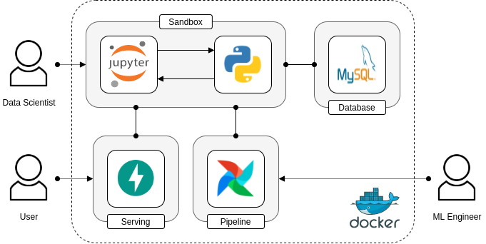
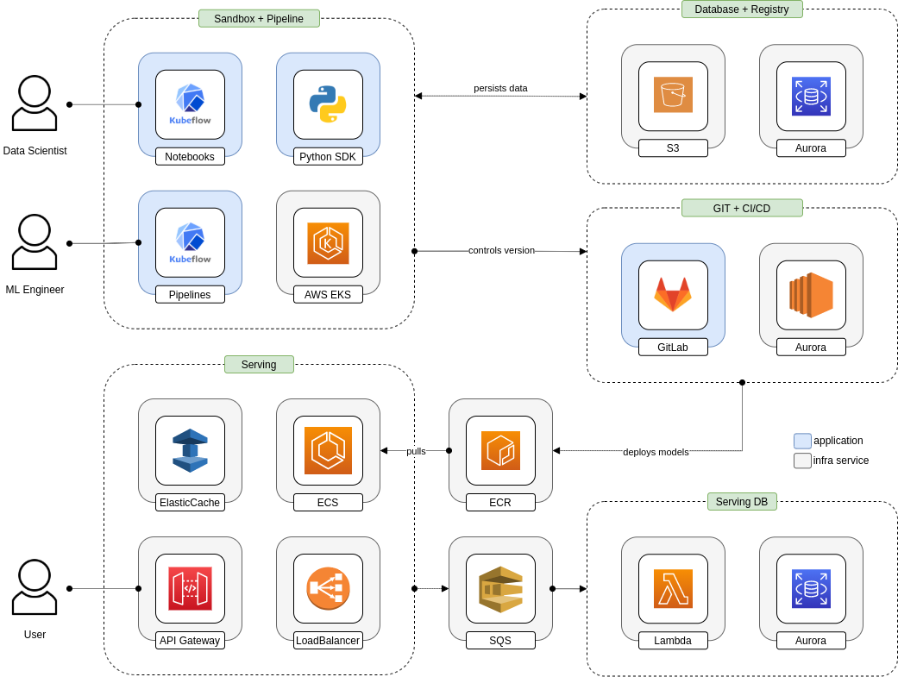

# iFood MLOps Readme

> This repository is the docs of my solution for the **[iFood ML Engineer test](https://github.com/ifood/ifood-data-ml-engineer-test)**.

## 1. Solution

> Checkout the project [repository](https://github.com/andre-marcos-perez/ifood-mlops-app) to know more!

The solution is the iFood MLOps App, a ML platform designed to help data scientists to develop and deploy ML models. It 
is composed by four main components tied together by a Python SDK: 

 - **Sandbox**: Jupyter based env to develop, train, test and deploy models;
 - **Pipeline**: Apache Airflow based pipeline to train, test and deploy models;
 - **Database**: MySQL based database to register ML experiments and predictions;
 - **Serving**: FastAPI based api to serve predictions.

<p align="center"></p>

## 2. Going to the Cloud

The solution on the cloud leverages the low price (and the elasticity of its backend on AWS ECS) of a EKS cluster and 
the Kubeflow ecosystem (notebooks, pipelines, etc.) to provide both the sandbox and pipeline components. The Python SDK 
is built on the notebook base image to ease the programmatic access to the pipeline, database (Aurora) and registry 
(S3). Production ready models and its serving code are version controlled on self hosted GitLab software (EC2) and 
deployed via ci/cd as a dockerized microservice on a ECS cluster. This cluster is interfaced by the API gateway for the 
end user (apps, clients, etc.). Predictions requests are load balanced (Elastic Load Balancer), cached (ElasticCache) 
and queued (SQS) to be further persisted (Lambda + Aurora) to provide the lowest latency possible. 

<p align="center"></p>

## 3. Bonus

What a fun! I have used the [Radare2](https://github.com/radareorg/radare2) software to reverse engineer the binaries.
The usage of C standard library to process strings (the famous *string.h*) speeded up the hacking process since it 
helped to understand the expected input. Also, the data area was full of hints since comparisons were made against data 
stored on it.

### 3.1. Level 01

The easiest one. The main code area used *string.h* to compare the input string with the one stored on the data area. 
Just had to take into account the (little) endianness used by the x86 processor.

> **Solution:** 

 - 1F00d{P13c3_0f_C4k3}

### 3.2. Level 01

This one required a two step solution. The first was to find out that the entry must be 21 characters long, again the 
*string.h* lib *len* method made things easier. The second one was way more tougher. It resembled a XOR encryption 
process and I had to use brute force strategy to break it with minor tweaks to speed it up. The key was to find out the 
periodic characteristic of the input. The code bellow took 4 seconds to run o my machine, a Intel(R) Core(TM) i7-8665U 
CPU @ 1.90GHz with 16 GB of memory.

```python
def main(a, b, c):

    chars = [0] * 18
    chars = chars + [a, b, c]

    if len(chars) == 0x15:
        f = 0x1337
        for char in chars:
            temp = char * int(0x1234)
            f = f ^ temp
        if f == 0xa48b7:
            print([hex(char) for char in chars])
            return True
        else:
            return False


if __name__ == '__main__':

    for i in range(0x7e):
        for j in range(0x7e):
            for k in range(0x7e):
                r = main(i, j, k)
                if r:
                    break
```

> **Solution:** (Many more with non ASCII chars).

 - BY{BY{BY{BY{BY{BY{BY{
 - B{YB{YB{YB{YB{YB{YB{Y
 - YB{YB{YB{YB{YB{YB{YB{
 - Y{BY{BY{BY{BY{BY{BY{B
 - {YB{YB{YB{YB{YB{YB{YB
 - {BY{BY{BY{BY{BY{BY{BY

### 3.3. Level 03

Haven't had the opportunity to try it out. :disappointed:

